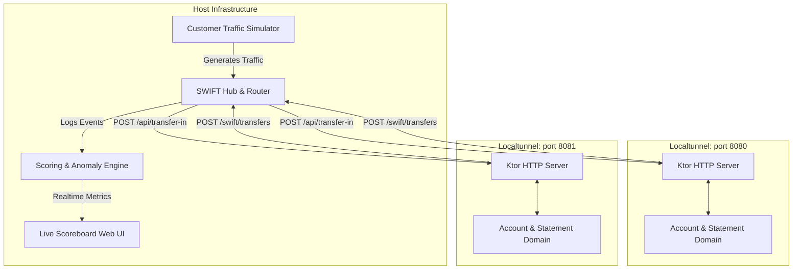

# Requirements

### Overview & Goals
Transform the classic 15-year-old Java Bank Kata into an engaging, interactive **Multiplayer Banking Kata** designed specifically for a **1–2 hour unconference workshop session**.

Participants take on the role of software engineers implementing their own banking node. A centralized, lightweight **SWIFT Network Server** (hosted by workshop facilitators) simulates client activities (deposits, withdrawals, inter-bank transfers) and routes money between participants' banks via local tunnels (e.g., `localtunnel`). A live web scoreboard displays cash flows, transaction throughput, and reliability rankings in real time.

### Target Audience & Session Format
- **Duration**: 90 to 120 minutes.
- **Audience**: Software engineers, craftsmen, and unconference attendees interested in TDD, Object Calisthenics, distributed systems, and API design.
- **Participation**: Solo or pairs (pair programming encouraged).

### Scope
- **In Scope**:
  - Migration of legacy Java 8 / Maven codebase to **Kotlin 2.x + Gradle Multi-Module (`build.gradle.kts`)**.
  - **Participant Bank Starter Kit (`:bank-starter`)**: Idiomatic Kotlin domain skeleton, pre-wired embedded Ktor web server, Object Calisthenics exercises, and localtunnel integration.
  - **Central SWIFT Hub (`:swift-hub`)**: BIC registry, transaction routing, inter-bank settlement, audit ledger, and reliability monitoring.
  - **Traffic Simulator & Live Scoreboard**: Automated customer simulation engine generating incoming transactions, plus a real-time web UI showing bank rankings, cash flow metrics, and error rates.
  - **Shared Contracts (`:shared-contracts`)**: Common DTOs, BIC/IBAN validation models, and serialization schemas.
  - **Documentation & Facilitation Pack**: Turnkey participant onboarding guide, facilitator cheat sheet, and 5-minute setup scripts.
- **Out of Scope**:
  - Persistent production SQL databases (all runtime state is kept in-memory for zero friction during workshops).
  - Heavy cloud infrastructure (designed to run entirely on the host laptop with localtunnel/ngrok).

### User Stories
- **As a Participant**, I want to clone a ready-to-run Kotlin template and start coding immediately with `./gradlew test` and `./gradlew run` so that I don't waste time configuring frameworks or build tools.
- **As a Participant**, I want to implement core banking domain features using Outside-In TDD and Object Calisthenics, then connect my bank to the live SWIFT network to handle real inter-bank transfers.
- **As a Facilitator**, I want to launch the central SWIFT hub and scoreboard with a single command and watch participant banks connect dynamically via localtunnel.
- **As a Facilitator**, I want to trigger progressive waves of traffic (from simple deposits to high-volume cross-bank transfers and edge cases) to test participant banks' resilience and correctness.

### Functional Requirements
1. **Participant Bank Capabilities**:
   - Process internal deposits and withdrawals.
   - Print/render account statements (date, debit, credit, balance).
   - Support statement filtering (deposits only, withdrawals only, date ranges).
   - Expose incoming transfer webhook endpoint (`POST /api/transfer-in`).
   - Initiate outgoing transfers via SWIFT hub endpoint (`POST /swift/transfers`).
2. **SWIFT Hub & Routing**:
   - Dynamic registration of participant banks (`POST /swift/register`) with assigned BIC and public tunnel URL.
   - Inter-bank transfer routing: Validate sender and receiver BICs, forward transfer to recipient bank, and confirm settlement.
   - Ledger integrity: Verify that no money is created or lost across transactions.
3. **Scoreboard & Game Mechanics**:
   - Points awarded for successful transaction processing within SLA (< 500ms).
   - Penalties for dropped transactions, timeouts, 500 internal errors, or invalid balance states.
   - Live visual dashboard displaying transaction velocity, error rate, total assets, and current ranking.

### Non-Functional Requirements
- **Onboarding Speed**: Participants must be up and running within 5 minutes (`git clone`, `./gradlew run`, `npx localtunnel --port 8080`).
- **Simplicity**: No external database or Docker dependencies required for participants.
- **Fault Tolerance**: Host SWIFT server handles participant disconnections and reconnects gracefully without crashing.

# Domain & Glossary

### Ubiquitous Language & Domain Terms

| Term | Definition | Context |
| :--- | :--- | :--- |
| **Account** | The core domain aggregate managing a customer's balance, transaction history, and statement generation. | Participant Bank Domain |
| **Amount** | Strongly-typed value object representing monetary values in whole cents (to prevent floating-point rounding errors). | Shared / Domain |
| **BIC (Bank Identifier Code)** | An 8-character unique alphanumeric identifier assigned to each participant bank (e.g., `BANKAXXX`, `KOTLBEXX`). | SWIFT Network |
| **IBAN** | Account identifier combining Country Code, BIC, and Account Number (e.g., `BE68BANKA0001234567`). | Shared Contracts |
| **Statement** | First-class collection representing the formatted chronological record of an account's financial activities. | Participant Bank Domain |
| **Transfer** | A two-sided monetary transaction moving funds from a source Account/Bank to a destination Account/Bank. | Network & Domain |
| **SWIFT Hub** | The central router and clearing house that orchestrates inter-bank communications and maintains the central audit ledger. | Host Platform |
| **Localtunnel / Ngrok** | Reverse proxy tool exposing participant local web servers (`http://localhost:8080`) to a public HTTPS endpoint for the SWIFT hub. | Network Layer |
| **Scoreboard** | Real-time facilitator dashboard tracking bank health, throughput, balance integrity, and competition points. | Workshop Operations |

---

### Object Calisthenics Mapping in Kotlin

To maintain the kata's core craftsmanship focus, participants are encouraged to apply the 9 rules using Kotlin features:

1. **Only One Level of Indentation per Method**: Short, focused functions and Kotlin higher-order functions.
2. **Don't Use the ELSE Keyword**: Guard clauses, sealed classes, and `when` expressions without redundant branches.
3. **Wrap All Primitives and Strings**: Use Kotlin `value class` (e.g., `@JvmInline value class Amount(val cents: Long)`).
4. **First-Class Collections**: Dedicated domain classes wrapping collections (e.g., `class StatementLines(private val lines: List<StatementLine>)`).
5. **One Dot per Line**: Law of Demeter, avoiding chained property drilling.
6. **Don't Abbreviate**: Expressive domain naming (`Transaction`, not `Tx`).
7. **Keep All Entities Small**: Maximum 50 lines per file/class.
8. **No Classes with More Than Two Instance Variables**: High cohesion, rich value composition.
9. **No Getters / Setters / Properties for State Extraction**: Tell-Don't-Ask principles; pass printers or visitors rather than querying state directly.

# Technical Design

### Current Implementation & Migration Strategy
The existing codebase is a Java 8 project with Maven, containing basic domain logic (`Account`, `Amount`, `Statement`, `StatementLine`, `Transaction`) and JBehave/JUnit tests for deposit, withdrawal, and statement printing.

The modernization migrates the repository to:
- **Build**: Gradle with Kotlin DSL (`build.gradle.kts`), Gradle wrapper 8.x.
- **Language**: Kotlin 2.x, targeting JVM 17+.
- **Structure**: Multi-module architecture cleanly isolating workshop infrastructure from participant starter code.

```
Bank-kata/
├── build.gradle.kts
├── settings.gradle.kts
├── gradle/
├── shared-contracts/            # DTOs, BIC/IBAN types, JSON models
│   └── src/main/kotlin/org/craftedsw/contracts/
├── bank-starter/                # Participant template project
│   ├── src/main/kotlin/org/craftedsw/bank/
│   │   ├── domain/              # Calisthenics Domain (Account, Statement, etc.)
│   │   ├── api/                 # Embedded Ktor HTTP routes & webhooks
│   │   └── BankApplication.kt   # Runnable main entrypoint
│   └── src/test/kotlin/org/craftedsw/bank/
├── swift-hub/                   # Facilitator SWIFT network & scoreboard
│   ├── src/main/kotlin/org/craftedsw/swift/
│   │   ├── router/              # Inter-bank transaction router & registry
│   │   ├── simulator/           # Customer traffic & fraud generator
│   │   ├── scoring/             # Scoring engine & anomaly detector
│   │   └── ui/                  # Live scoreboard web server (Ktor + SSE/WebSockets)
│   └── src/test/kotlin/org/craftedsw/swift/
├── docs/
│   ├── PARTICIPANT_GUIDE.md
│   └── FACILITATOR_GUIDE.md
└── scripts/
    ├── start-tunnel.sh
    └── start-swift-hub.sh
```

---

### Architecture & System Interactions



---

### API Specifications & Communication Contracts

#### 1. SWIFT Registration (`POST /swift/register`)
- **Caller**: Participant Bank on startup
- **Payload**:
  ```json
  {
    "bic": "BANKAXXX",
    "name": "Bank Alpha",
    "webhookUrl": "https://brave-fox-42.loca.lt"
  }
  ```
- **Response**: `200 OK` with session confirmation and assigned initial customer accounts.

#### 2. Participant Incoming Webhook (`POST /api/transfer-in`)
- **Caller**: SWIFT Hub (forwarding funds from another bank or customer deposit)
- **Payload**:
  ```json
  {
    "transactionId": "tx-98124",
    "fromIban": "BE68BANKB0001234567",
    "toIban": "BE68BANKA0009876543",
    "amountCents": 150000,
    "timestamp": "2026-10-01T14:30:00Z",
    "reference": "Consulting Invoice"
  }
  ```
- **Response**: `200 OK` (Accepted & Credited) or `400/404` with error details.

#### 3. Participant Outgoing Transfer (`POST /swift/transfers`)
- **Caller**: Participant Bank
- **Payload**:
  ```json
  {
    "fromIban": "BE68BANKA0009876543",
    "toIban": "BE68BANKB0001234567",
    "amountCents": 50000,
    "reference": "Split Lunch"
  }
  ```
- **Response**: `200 OK` with SWIFT transaction receipt.

---

### Architectural Decision Records (ADRs)

- **ADR-0001: Use Ktor Embedded Server for Participant Bank and SWIFT Hub**
  - *Context*: Workshop attendees have limited time; bulky frameworks like Spring Boot take longer to start, require larger dependencies, and add annotation magic that obscures TDD boundaries.
  - *Decision*: Use embedded Ktor (Netty engine) with `kotlinx.serialization`.
  - *Consequences*: Instant startup (< 1 sec), explicit code routing, small memory footprint.

- **ADR-0002: Localtunnel HTTP Webhooks for Inter-Bank Networking**
  - *Context*: Attendees run code on laptops behind conference firewalls / NAT.
  - *Decision*: Standardize on HTTP REST exposed via `localtunnel` (`npx localtunnel`) with fallback to `ngrok`.
  - *Consequences*: Zero firewall friction, inspectable HTTP requests via browser/curl, simple webhook debugging.

- **ADR-0003: Long Cents Representation for Money (Value Object)**
  - *Context*: Floating point calculations cause precision drift in multi-hop transactions.
  - *Decision*: Model `Amount` as integer cents (`@JvmInline value class Amount(val cents: Long)`).
  - *Consequences*: Exact arithmetic, zero rounding anomalies in scoring engine.

# Workshop Schedule & Facilitation

### Unconference Workshop 2-Hour Schedule

| Time | Phase | Activity & Milestones |
| :--- | :--- | :--- |
| **00:00 - 00:15** | **Kickoff & Setup** | - Welcome, intro to the kata, Object Calisthenics rules.<br>- Clone repo, run `./gradlew run` and tunnel script.<br>- Register BIC with the SWIFT Hub. |
| **00:15 - 00:45** | **Round 1: Internal Bank Kata (TDD)** | - Implement deposits, withdrawals, and balance calculation test-first.<br>- Implement statement printing and filters (deposits/withdrawals only).<br>- Automated tests turning green. |
| **00:45 - 01:15** | **Round 2: The SWIFT Network (Multiplayer)** | - Implement incoming webhook endpoint (`/api/transfer-in`).<br>- Implement outgoing transfer logic via SWIFT hub.<br>- First live cross-bank transfers between participants. |
| **01:15 - 01:40** | **Round 3: Chaos & Volume (Live Traffic)** | - Facilitator spins up simulated traffic generator.<br>- Sudden bursts of deposits, withdrawals, and rapid transfers.<br>- Error handling: dealing with timeouts, invalid IBANs, and insufficient funds.<br>- Live leaderboard tracking uptime and accuracy. |
| **01:40 - 01:50** | **Wrap-up & Winner Announcement** | - Review scoreboard metrics (Most Reliable Bank, Richest Bank, Cleanest Design). |
| **01:50 - 02:00** | **Retrospective & Lessons Learned** | - Discussion on Object Calisthenics experience, TDD flow, and distributed transaction pitfalls. |

---

### Facilitator Preparation Checklist
1. **Pre-session**:
   - Verify Node.js / `npx localtunnel` or `ngrok` is working.
   - Start SWIFT Hub locally: `./gradlew :swift-hub:run`.
   - Open Scoreboard dashboard at `http://localhost:9000` on projector.
2. **During session**:
   - Monitor the BIC registration feed as attendees join.
   - Adjust traffic simulator rate sliders from 1 tx/sec to 20 tx/sec during Round 3.
   - Announce mini-challenges (e.g. "Bank Alpha just sent $10,000 to Bank Beta!").

# Testing & Validation

### Validation Approach
Verification follows a multi-tier testing strategy to ensure both code craftsmanship and network reliability.

#### 1. Unit Tests (Domain Level)
- **Account & Transaction Tests**: Test-driven verification of balance calculations, negative transaction handling, and chronological statement records without framework dependencies.
- **Statement & Filter Tests**: Verify formatting output against expected layout and test filtering predicates (date range, credit-only, debit-only).
- **Calisthenics Integrity**: Validate value classes and immutability invariants.

#### 2. Component & API Tests
- **Ktor Routing Tests**: Use `testApplication` to test `/api/transfer-in`, `/api/deposit`, and `/api/statement` without binding actual network ports.
- **Error Handling**: Verify correct HTTP status codes (`400 Bad Request` for negative amounts, `404 Not Found` for unknown accounts, `422 Unprocessable Entity` for insufficient funds).

#### 3. SWIFT Hub & Multiplayer Integration Tests
- **Simulated Multi-Bank Flow**: In-process test spawning two mock participant banks (`Bank A`, `Bank B`) and routing a transfer through the SWIFT Hub, asserting that:
  - Bank A's balance decreases by the exact transfer amount.
  - Bank B's balance increases by the exact transfer amount.
  - SWIFT Hub audit ledger remains balanced (`Total Credits == Total Debits`).
- **Resilience Scenarios**: Test timeout handling when a participant bank drops offline or experiences artificial network latency.

# Delivery Steps

### ✓ Step 1: Modernize Build System and Port Core Domain to Kotlin
The repository builds with Gradle Kotlin DSL and contains a modernized Kotlin port of the existing Bank Kata domain logic and unit tests with 100% test pass rate.

- Replace Maven `pom.xml` with a root `settings.gradle.kts` and multi-module layout (`:shared-contracts`, `:bank-starter`, `:swift-hub`).
- Configure Kotlin 2.x, JVM target 17/21, and modern test dependencies (JUnit 5, AssertJ / Kotest assertions).
- Port the legacy Java domain classes (`Account`, `Amount`, `Statement`, `StatementLine`, `Transaction`) and tests to idiomatic Kotlin while strictly preserving the 9 Object Calisthenics constraints (value classes, first-class collections, no getters/setters for state extraction, single level of indentation).
- Ensure `./gradlew test` passes cleanly across all modules.

### ✓ Step 2: Implement Shared Contracts and Participant Bank Starter Kit
The `:bank-starter` module provides participants with a runnable, low-friction HTTP bank server wired to domain interfaces and pre-configured for local tunneling.

- Define shared DTOs and data models in `:shared-contracts` (`TransferRequest`, `TransferResult`, `DepositRequest`, `WithdrawRequest`, `StatementResponse`, `BicCode`, `Iban`).
- Implement an embedded lightweight Ktor / HTTP routing layer in `:bank-starter` mapping incoming HTTP webhooks (`POST /api/transfer-in`, `POST /api/deposit`, `POST /api/withdraw`, `GET /api/statement`) to the underlying `Account` domain logic.
- Add an inter-bank client in `:bank-starter` to call the central SWIFT network when an outgoing transfer occurs (`POST /swift/transfers`).
- Create an automated test harness in `:bank-starter` verifying that participants can develop against domain interfaces via TDD before connecting to the live network.

### ✓ Step 3: Build Central SWIFT Routing Hub and Registration Engine
The `:swift-hub` module runs a standalone central server that maintains the participant BIC registry, routes transfers between banks, and validates balance consistency.

- Implement participant registration endpoints (`POST /swift/register`) accepting bank name, BIC code, and public Localtunnel/ngrok URL.
- Implement inter-bank transfer routing logic: receiving transfer requests from sender banks, validating recipient BIC, dispatching webhook calls to recipient banks, and returning transaction receipts.
- Implement connectivity health checks and timeout handlers to detect unreachable or slow participant banks.
- Add an in-memory audit ledger recording all inter-bank settlements to detect double-spending or dropped funds.

### ✓ Step 4: Implement Traffic Simulator, Anomaly Engine, and Live Scoreboard
The host engine generates realistic client traffic flows, tracks participant reliability/correctness scores, and displays a real-time web dashboard.

- Implement a simulated customer traffic generator in `:swift-hub` generating automated deposits, withdrawals, and cross-bank transfers with configurable frequency and ramp-up stages.
- Build a scoring and anomaly detection engine that awards points for successful settlements and deducts penalty points for dropped transfers, invalid balances, timeouts, or 500 errors.
- Create a lightweight real-time web dashboard (HTML/SSE or WebSocket) displaying live cash flows, participant bank health status, transaction volume, and leaderboard ranking.

### ✓ Step 5: Add Facilitation Materials, Participant Quickstart, and E2E Scenarios
Facilitators and participants have end-to-end documentation, one-command run scripts, and verification tests for seamless execution during a 1-2 hour unconference session.

- Write `PARTICIPANT_GUIDE.md` detailing the 5-minute quickstart: cloning, configuring BIC, running the localtunnel script, and step-by-step TDD progression milestones.
- Write `FACILITATOR_GUIDE.md` detailing session timing (0–120 min schedule), running the SWIFT hub, projecting the live dashboard, and managing network hiccups.
- Add turnkey helper scripts for launching participant tunnels (`run-tunnel.sh` / `npm exec localtunnel`) and starting the bank app.
- Provide end-to-end integration tests in `:swift-hub` validating multi-bank transfer scenarios against mock participant banks.